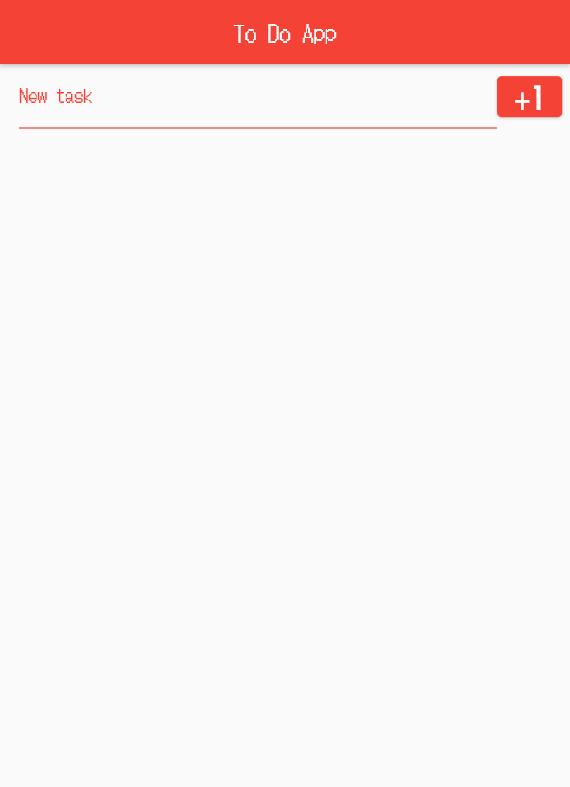
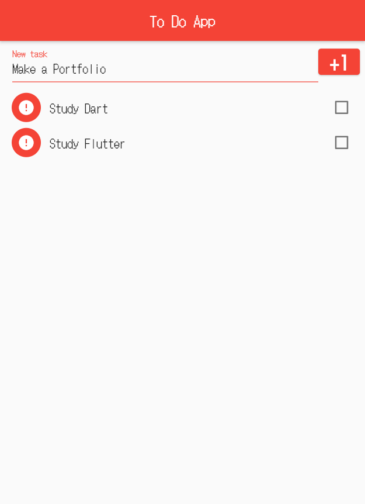
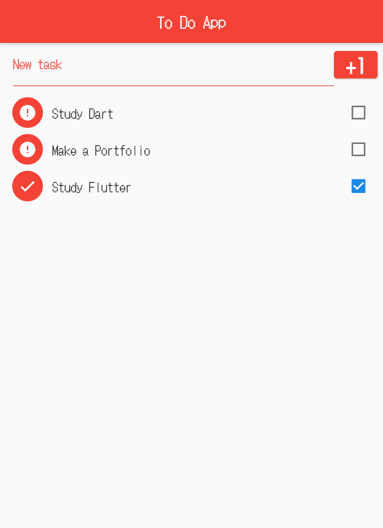
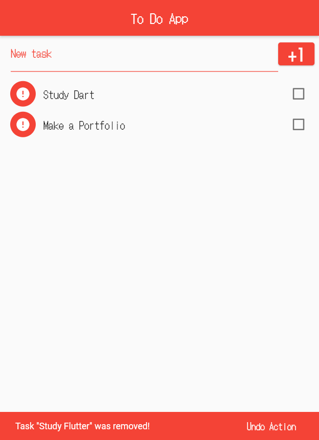

# 📝 To Do App

Aplicação Mobile em Flutter - To Do App (Gestão de Tarefas).

## ⚙️ Informações adicionais

- Flutter: v. 2.5.1
- Dart: v. 2.14.2
- Path Provider: v. 1.1.0

## 🖼️ Imagens

  
  

  
  

